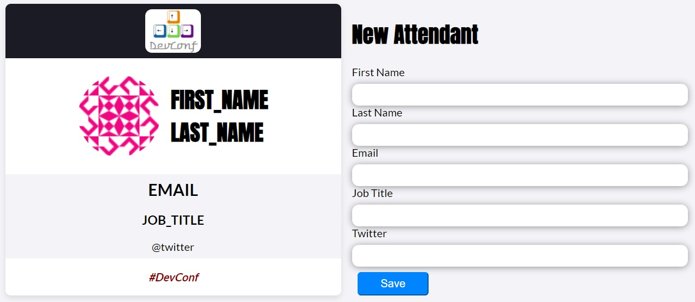

# Card App to create, read, update and delete cards for any event.

## Table of contents

- [Overview](#overview)
  - [The challenge](#the-challenge)
  - [Screenshot](#screenshot)
  - [Links](#links)
- [My process](#my-process)
  - [Built with](#built-with)
  - [What I learned](#what-i-learned)
  - [Continued development](#continued-development)
  - [Useful resources](#useful-resources)
- [Author](#author)
- [Acknowledgments](#acknowledgments)

## Overview

### The challenge

Users should be able to:

- Click on a card to see its detailed information, delete or modify it
- See all the available cards to work with from mockAPI.io site
- Filter cards by name
- Create new cards

### Screenshot

### Links

- Solution URL: [Github](https://github.com/AlbertoCastroF/CardManager)
- Live Site URL: [GithupPages](https://albertocastrof.github.io/CardManager/)

## My process

This is a project I created one year ago following a tutorial, back then i had very little understanding of React and didnt graps all the concepts necessary for its creation. This led me to revisit this project now to update it and use it as one of my portfolio items.

There are some differences between the old and new version. The old version was created using JSON server to acquire the data from a local simulated REST API, class based components and an old react-router version. The new version uses mockAPI.io as a data source, function based components and react-router v6. It was not possible to share the project using JSON server via github pages so i decided to switch to a more flexible option using mockAPI.

### Built with

- Semantic HTML5 markup
- CSS custom properties
- Flexbox
- CSS Grid
- React router v6
- [React](https://reactjs.org/) - JS library

### What I learned

I created this App from the ground up again to solidify and reaffirm my react knowledge, it involves technologies and concepts like:
-Composition
-React router
-React Memo
-React Hooks
-CRUD
-SPA
-REST API

### Continued development

I'll continue expanding my React knowledge to create more complex Apps.

### Useful resources

- [React Router Guide](https://reactrouter.com/web/guides/quick-start) - Everything about react router.
- [UseEffect article](https://overreacted.io/a-complete-guide-to-useeffect/#dont-lie-to-react-about-dependencies) - A guide to understand useEffect better.

## Author

- Website - [Alberto Castro Flores](https://www.linkedin.com/in/alberto-castro-flores-02007959/)

## Acknowledgments

Thanks to the scrimba's and Danny Thompson's discord communities who helped me in some of the troubles i had while creating this project 😁.
Scrimba discord [HERE](https://discord.com/login?redirect_to=%2Fchannels%2F684009642984341525%2F688827098957348907)
Danny's discord [HERE](https://discord.gg/XhxVQUuA)
